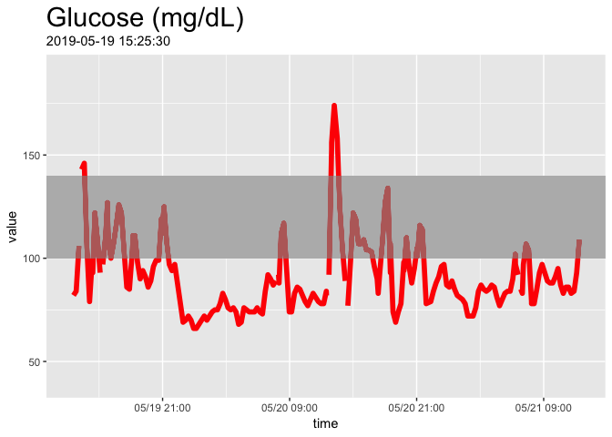
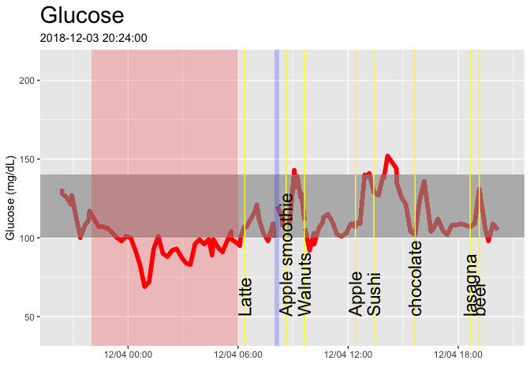
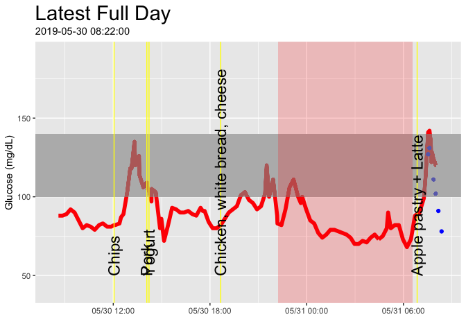
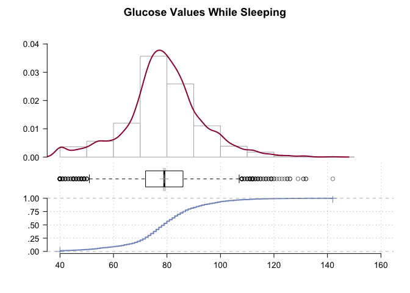
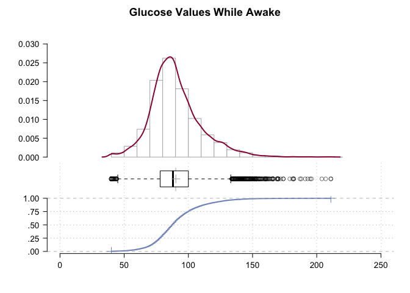

Continuous Glucose Monitoring with Freestyle Libre
================
Richard Sprague
2019-10-28

See [Continous Glucose Monitoring: Start
Here](http://richardsprague.com/notes/continuous-glucose-monitoring/)

I’ve been tracking my glucose levels 24 x 7 using a continuous glucose
monitor from Abbott Labs called the [Freestyle
Libre](https://www.freestylelibre.us/index.html).

View a Shiny version of my current data at
<https://personalscience.shinyapps.io/librelink/>.
\[[Source](https://github.com/richardsprague/cgm/tree/master/librelink)\]

Read (and edit\!) my [Continuous Glucose Monitoring Hackers
Guide](https://docs.google.com/document/d/11DFx0E-ZQ-r_D1SqXvMtvkDCjx6j7NevrE43WSaKyJE/edit?usp=sharing)
for details for how to get started, plus as many resources as I know
about other apps and links that you might find useful for beginning your
own CGM analysis.

This is a short R script I use for my analysis.

-----

## Prerequisites

Besides the working sensor, to run this script you’ll need:

  - A registered account on Freestyle’s official site:
    [libreview.com](https://www2.libreview.com/)
  - Data downloaded from the Libreview site. (I download it and convert
    to XLSX format in the file “Librelink.xlsx”)
  - A separate activity file to register your food, exercise, sleep, and
    other events. (Another XLSX file I call “Activity.XLSX”)

See examples of all my raw data files in the
[librelink](https://github.com/richardsprague/cgm/tree/master/librelink)
directory.

One you have downloaded the raw Librelink data and created the activity
file, you must read the results into two dataframes:

`libre_raw` : the raw output from a Librelink CSV file. You could just
read.csv straight from the CSV if you like.

`activity_raw`: your file containing the metadata about whatever you’d
like to track. The following script assumes you’ll have variables for
`Sleep`, `Exercise`, `Food`, and a catch-all called `Event`.

Now clean up the data and then set up a few other useful variables. Be
careful about time zones: the raw data comes as UTC time, so you’ll need
to convert everything to your local time zone if you want the following
charts to match.

``` r
library(tidyverse)
library(lubridate)
library(ggthemes)

activity_raw$Start <- activity_raw$Start %>% lubridate::parse_date_time(order = "ymd HMS",tz = "US/Pacific")
activity_raw$End <- activity_raw$End %>% lubridate::parse_date_time(order = "ymd HMS", tz = "US/Pacific")


glucose <- libre_raw %>% select(time = "Meter Timestamp", 
                                scan = "Scan Glucose(mg/dL)",
                                hist = "Historic Glucose(mg/dL)",
                                strip = "Strip Glucose(mg/dL)",
                                food = "Notes")

#glucose$time <- readr::parse_datetime(libre_raw$`Meter Timestamp`,locale = locale(tz="US/Pacific"))

glucose$time <- as_datetime(libre_raw$`Meter Timestamp`, tz = "US/Pacific")
# 
glucose$value <- dplyr::if_else(is.na(glucose$scan),glucose$hist,glucose$scan)

# apply correction for faulty 2019-01-08 sensor
#glucose$value <- dplyr::if_else(glucose$time>as_datetime("2019-01-08"),glucose$value+35,glucose$value)

# apply correction for faulty 2019-03-24 sensor
#glucose$value <- dplyr::if_else(glucose$time>as_datetime("2019-03-23"),glucose$value+35,glucose$value)


glucose_raw <- glucose

# libre_raw$`Meter Timestamp` %>% lubridate::parse_date_time(order = "ymd HMS",tz = "US/Pacific")
```

Set up a few convenience functions.

``` r
source("cgm_display.R")
```

View the last couple days of the dataset:

``` r
startDate <- now() - days(2) #min(glucose$time)

#cgm_display(startDate,now()-days(6))

cgm_display(startDate,startDate + days(2))
```

<!-- -->

Here’s just for a single day. Note that the commented-out lines will let
you output to a PDF file if you like.

``` r
#pdf("icecream.pdf", width = 11, height = 8.5)
cgm_display(start = min(glucose_raw$time),min(glucose_raw$time)+hours(24))
```

<!-- -->

``` r
#dev.off()
```

The final full day of the dataset:

``` r
cgm_start_plot(startTime = max(glucose_raw$time)-days(1), timeLength = 24, title = "Latest Full Day")
```

<!-- -->

## Food types

I measured myself while trying various foods. Click
[here](food_effects.md) to see the results.

## Basic Statistics

What is my average glucose level while sleeping?

``` r
library(lubridate)

options(scipen = 999)

# all sleep intervals, using the lubridate function lubridate::interval
# sleep_intervals <- interval(activity_raw %>% dplyr::filter(Activity == "Sleep") %>% select(Start)
#                             %>% unlist() %>% as_datetime(),
#                             activity_raw %>% dplyr::filter(Activity == "Sleep") %>% select(End) 
#                             %>% unlist() %>% as_datetime())

activity_intervals <- function(activity_raw_df, activity_name){
  interval(activity_raw_df %>% dplyr::filter(Activity == activity_name) %>% select(Start)
                            %>% unlist() %>% as_datetime(),
                            activity_raw_df %>% dplyr::filter(Activity ==activity_name) %>% select(End) 
                            %>% unlist() %>% as_datetime())
}


glucose %>% filter(apply(sapply(glucose$time,
                                function(x) x %within% activity_intervals(activity_raw,"Sleep")),2,any)) %>% select(value) %>% 
  DescTools::Desc(main = "Glucose Values While Sleeping")
```

    ## ------------------------------------------------------------------------- 
    ## Describe . (tbl_df, tbl, data.frame):
    ## 
    ## data frame:  3787 obs. of  1 variables
    ##      3787 complete cases (100.0%)
    ## 
    ##   Nr  ColName  Class    NAs  Levels
    ##   1   value    numeric  .          
    ## 
    ## 
    ## ------------------------------------------------------------------------- 
    ## Glucose Values While Sleeping
    ## 
    ##   length       n    NAs  unique     0s   mean  meanCI
    ##    3'787   3'787      0      99      0  80.64   80.21
    ##           100.0%   0.0%           0.0%          81.06
    ##                                                      
    ##      .05     .10    .25  median    .75    .90     .95
    ##    58.00   66.00  74.00   80.00  87.00  96.00  103.00
    ##                                                      
    ##    range      sd  vcoef     mad    IQR   skew    kurt
    ##   119.00   13.35   0.17   10.38  13.00   0.22    2.37
    ##                                                      
    ## lowest : 40.0 (31), 41.0 (5), 42.0 (4), 43.0 (3), 44.0 (3)
    ## highest: 142.0, 145.0, 152.0, 155.0, 159.0

<!-- -->

``` r
glucose %>% filter(apply(sapply(glucose$time,
                                function(x) !(x %within% activity_intervals(activity_raw,"Sleep"))),
                         2,
                         any)) %>% select(value) %>% 
  DescTools::Desc(main = "Glucose Values While Awake")
```

    ## ------------------------------------------------------------------------- 
    ## Describe . (tbl_df, tbl, data.frame):
    ## 
    ## data frame:  14475 obs. of  1 variables
    ##      14346 complete cases (99.1%)
    ## 
    ##   Nr  ColName  Class    NAs         Levels
    ##   1   value    numeric  129 (0.9%)        
    ## 
    ## 
    ## ------------------------------------------------------------------------- 
    ## Glucose Values While Awake
    ## 
    ##   length       n    NAs  unique      0s    mean  meanCI
    ##   14'475  14'346    129     155       0   91.45   91.14
    ##            99.1%   0.9%            0.0%           91.76
    ##                                                        
    ##      .05     .10    .25  median     .75     .90     .95
    ##    66.00   72.00  80.00   88.00  100.00  116.00  128.00
    ##                                                        
    ##    range      sd  vcoef     mad     IQR    skew    kurt
    ##   181.00   19.03   0.21   14.83   20.00    1.06    2.81
    ##                                                        
    ## lowest : 40.0 (33), 41.0 (5), 42.0 (5), 43.0 (3), 44.0 (7)
    ## highest: 207.0, 210.0, 211.0 (2), 217.0 (2), 221.0

<!-- -->

``` r
glucose %>% filter(apply(sapply(glucose$time,
                                function(x) x %within% activity_intervals(activity_raw,"Exercise")),2,any)) %>% select(value) %>% 
  DescTools::Desc(main = "Glucose Values While Exercising")
```

    ## ------------------------------------------------------------------------- 
    ## Describe . (tbl_df, tbl, data.frame):
    ## 
    ## data frame:  109 obs. of  1 variables
    ##      108 complete cases (99.1%)
    ## 
    ##   Nr  ColName  Class    NAs       Levels
    ##   1   value    numeric  1 (0.9%)        
    ## 
    ## 
    ## ------------------------------------------------------------------------- 
    ## Glucose Values While Exercising
    ## 
    ##   length      n    NAs  unique      0s    mean  meanCI
    ##      109    108      1      57       0   99.44   96.11
    ##           99.1%   0.9%            0.0%          102.78
    ##                                                       
    ##      .05    .10    .25  median     .75     .90     .95
    ##    73.35  78.00  87.00  100.00  110.00  121.30  135.30
    ##                                                       
    ##    range     sd  vcoef     mad     IQR    skew    kurt
    ##    79.00  17.49   0.18   17.79   23.00    0.50   -0.03
    ##                                                       
    ## lowest : 67.0, 69.0, 70.0, 71.0, 72.0
    ## highest: 136.0 (2), 137.0, 144.0, 145.0, 146.0

<!-- -->
