How specific foods affect my glucose levels
================
Richard Sprague
2019-08-26

Here are my glucose levels each time I eat a particular food.

First, oatmeal:

``` r
foodlist <- c("Oatmeal (plain)","Oatmeal w/milk","Oatmeal w/butter", "Oatmeal w/cinnamon", "Oatmeal (Reducose)")
food_effect(foodlist) %>% group_by(experiment) %>% mutate(delta = (time - min(time))/60) %>% ggplot(aes(x=delta,y=value, color = experiment)) + geom_line(size = 2) + scale_x_continuous() + labs(title = "Glucose after eating oatmeal", x = "Minutes", y = "mg/dL")
```

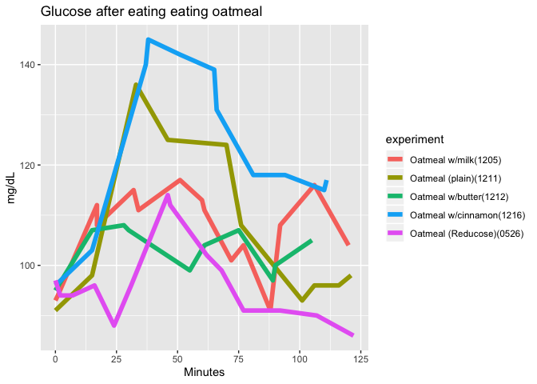<!-- -->

and a bunch of other foods:

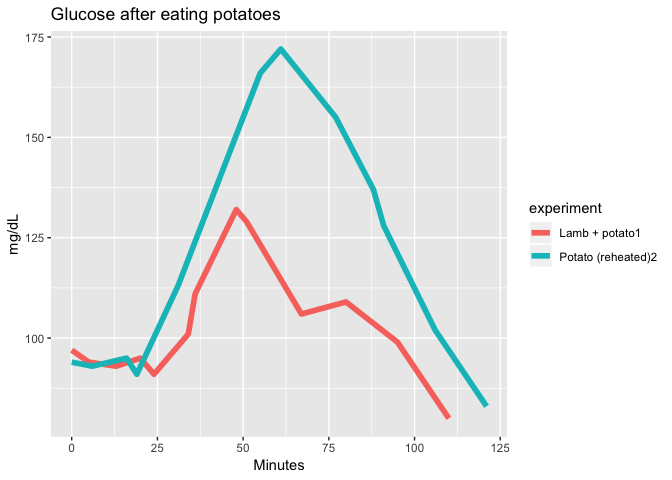<!-- -->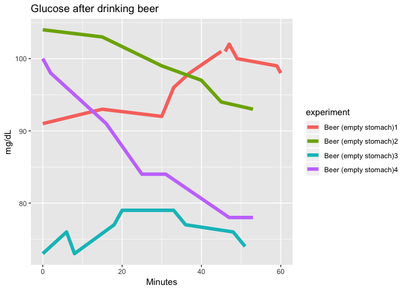<!-- -->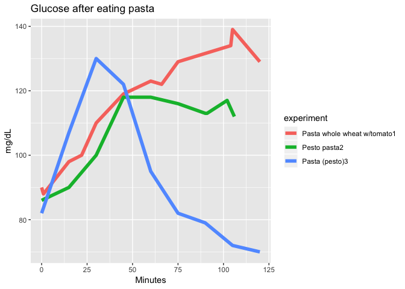<!-- -->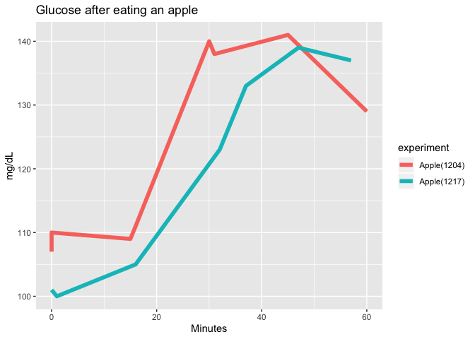<!-- -->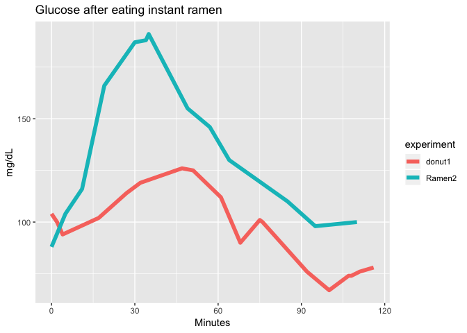<!-- -->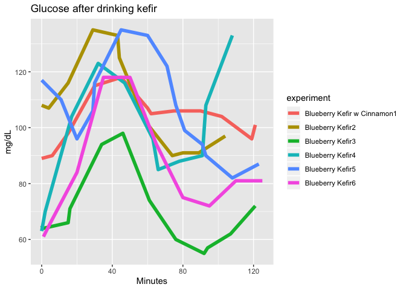<!-- -->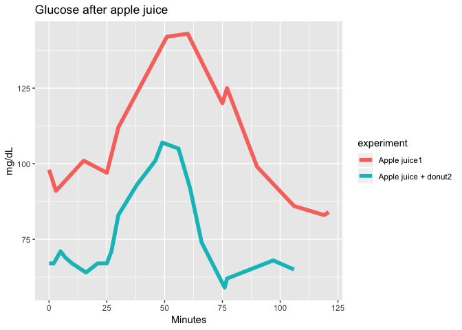<!-- -->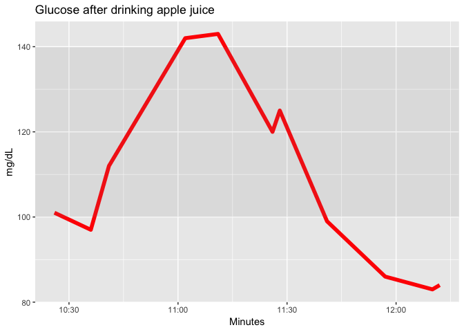<!-- -->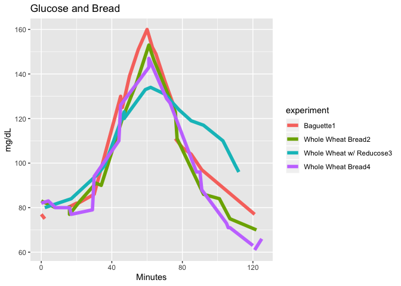<!-- -->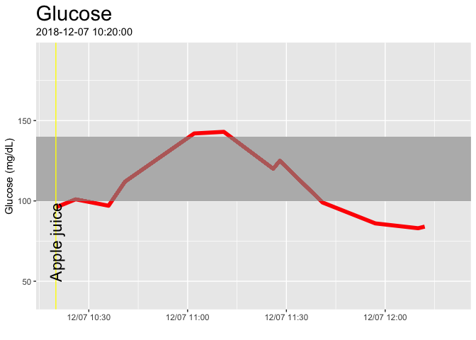<!-- -->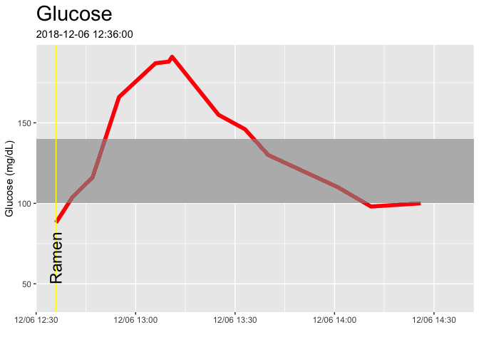<!-- -->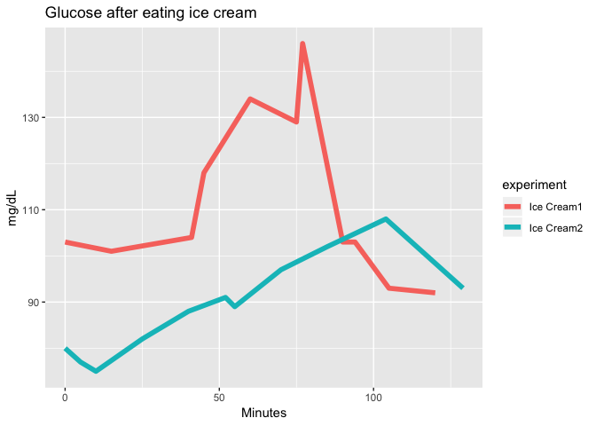<!-- -->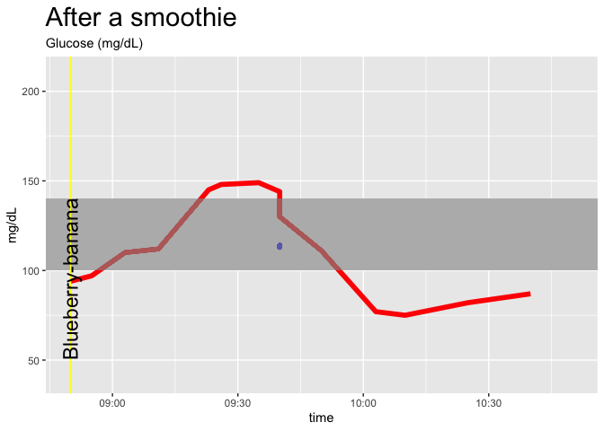<!-- -->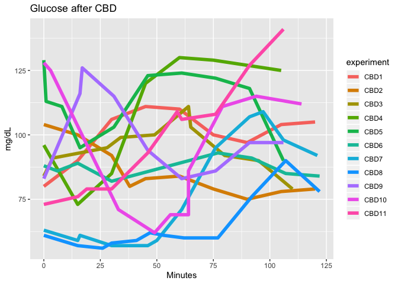<!-- -->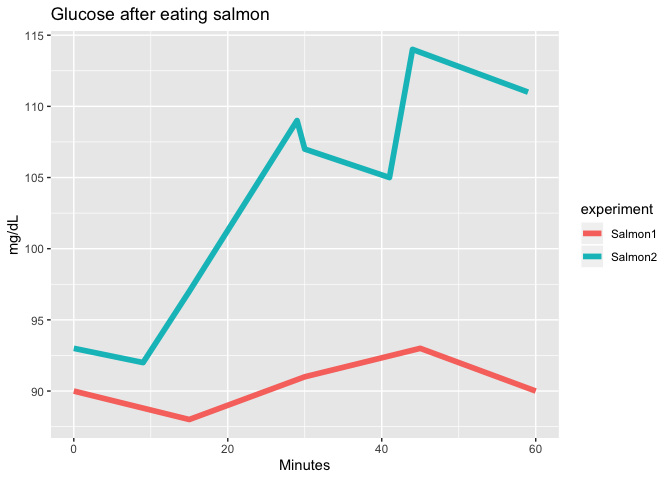<!-- -->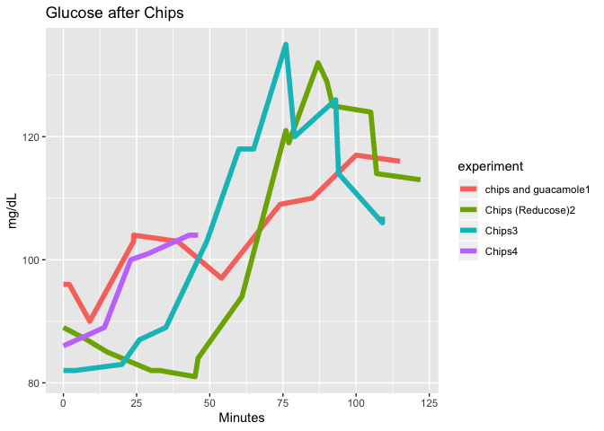<!-- -->
